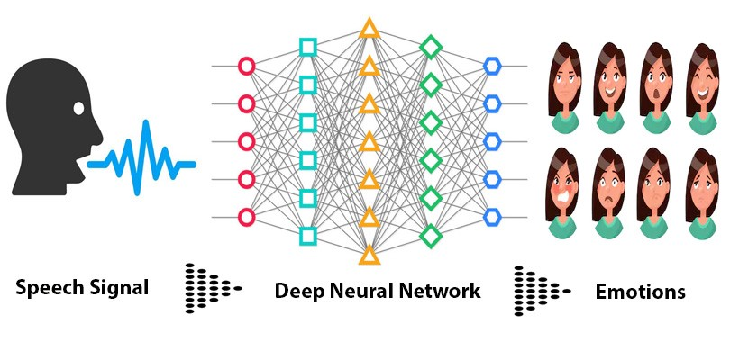

# Speech Emotion Recognition

Web-application based on ML model for recognition of emotion for selected audio file. You can try it  [**here**](https://speechrecogz.el.r.appspot.com/)

## Description
This project is a part of the final **Deep Learning** project for **Alma Better Deep Learning Capstone Project**. 

Datasets used in this project
* Ryerson Audio-Visual Database of Emotional Speech and Song (**Ravdess**)
* Toronto emotional speech set (**Tess**)

Digital signal processing is an emerging field of research in this era. Recently, many researchers have developed a various approaches in this area for SER from over the past decade.

Nowadays, mostly researchers utilize deep learning techniques for SER using Mel-scale filter bank speech spectrogram as an input feature. A spectrogram is a 2-D representation of speech signals which is widely used in convolutional neural networks (CNNs) for extracting the salient and discriminative features. Similarly, we can utilize the transfer learning strategies for SER using speech spectrograms passing through pre-trained CNNs models like VGG, DenseNet or Alex-Net. 

